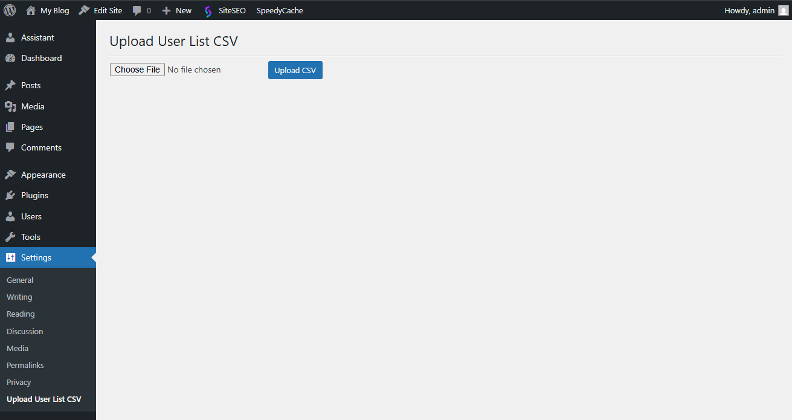
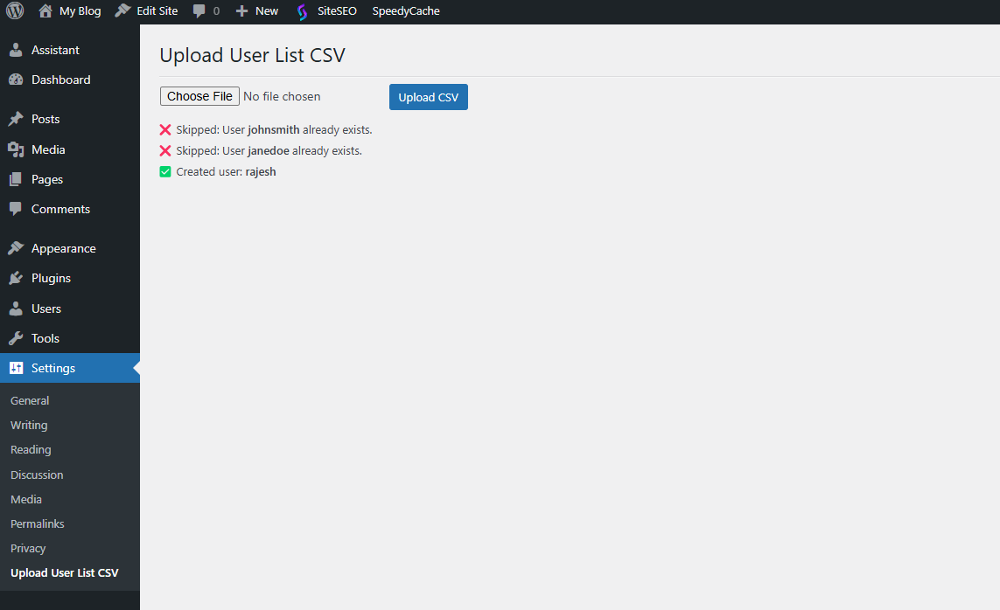

# Upload User CSV

**Upload User CSV** is a simple and free WordPress plugin that allows you to bulk upload users to your site using a CSV file. It's great for quickly adding users without needing to enter them manually.

---

## 🚀 Features

- Upload users via CSV file.
- Automatically skips existing users (by username or email).
- Simple and clean interface under WordPress Settings.
- Fast, lightweight, and easy to use.

---

## 📦 Installation

1. **Download the plugin ZIP** from GitHub:  
   👉 [https://github.com/Rajeshpaul1994/upload-user-csv](https://github.com/Rajeshpaul1994/upload-user-csv)

2. **Upload the ZIP file** to your WordPress site:  
   - Go to your WordPress Admin Dashboard  
   - Navigate to **Plugins > Add New > Upload Plugin**  
   - Upload the downloaded ZIP file  
   - Click **Install Now** and then **Activate**

3. After activation, you'll see a new menu option:  
   **Settings > Upload User List CSV**

   ## 📸 Screenshot

   Here's what the upload form looks like:

---

## 📁 How to Use

1. Click on **Settings > Upload User List CSV** in your WordPress dashboard.
2. You'll see a file upload form.
3. Prepare your CSV file with the following **column headers**:
4. Upload the CSV file and click **Upload CSV**.

> ✅ If a user already exists (based on username or email), they will be skipped.  
> 🆕 New users will be created automatically.

## 📸 Screenshot

After submit looks like:

---

## 🧑‍💻 Author

Created with ❤️ by [Rajesh Paul](https://github.com/Rajeshpaul1994)  
Feel free to contribute, report issues, or give feedback on GitHub!

---

## 📄 License

This plugin is open-source and freely available under the [MIT License](LICENSE).

